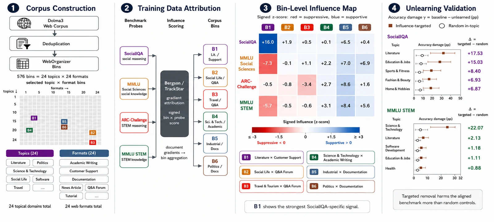

<div align="center">
  
  <h1>Capability Provenance in Language Models</h1>
  <p><em>A Case Study in Social Reasoning</em></p>

  <!-- badges -->
  <p>
    <a href="https://arxiv.org/abs/2606.19625"></a>
    <a href="https://eilab.gatech.edu/social-data-attribution/"></a>
    <a href="https://eilab.gatech.edu/social-data-attribution/"></a>
    
    <a href="LICENSE"></a>
    
    
    
  </p>

  <p>
    <em>The software for <strong>Capability Provenance in Language Models</strong> (COLM 2026):</em><br>
    a training-data attribution pipeline that maps which regions of a pretraining corpus
    support different reasoning capabilities, and validates those regions with targeted unlearning.
  </p>

  
  <p><sub>Figure 1: corpus-scale attribution pipeline — bin Dolma3, score benchmark probes, aggregate signed influence, validate with unlearning.</sub></p>
</div>

## Overview

This repository will host the audited code for **"Capability Provenance in Language Models: A Case Study in Social Reasoning"** (COLM 2026). The pipeline runs gradient-based training-data attribution over a stratified sample of the Dolma3 corpus, aggregates document-level influence to corpus regions defined by the WebOrganizer 24×24 topic-by-format taxonomy, and validates the flagged regions with selective unlearning.

The full results, figures, and method write-up live in the **[paper](https://arxiv.org/abs/2606.19625)** and on the **[project site](https://eilab.gatech.edu/social-data-attribution/)**. This repository is the software.

> ⚠️ **Status.** The project website is live now. The audited code and aggregate artifacts (sampling manifests, the 576×4 bin-level influence matrix, unlearning checkpoints) arrive with the camera-ready release. Sections marked **pending** below are staged for that release and filled when the code ports in.

## Results at a glance

The headline scale of the study (full analysis and figures in the paper and on the site):

| | |
|---|---|
| **576** topic-format bins | **5.68M** documents in the working set |
| **4** contrastive benchmarks | **+1.60 pp** SocialIQA unlearning damage (p ≈ 10⁻⁵) |

## Repository structure

> Pending the code port. The intended layout mirrors the audited pipeline; final paths are confirmed at release.

```
src/
├── data_attribution/      # attribution, benchmark probes, aggregation, analysis
│   ├── attribution/       # gradient-based TDA (TrackStar via Bergson)
│   ├── evaluation/        # OLMES benchmark probes
│   └── analysis/          # bin-level influence aggregation, cross-benchmark stats
├── dolma/                 # corpus construction: dedup, WebOrganizer enrichment, stratified sampling
└── unlearning/            # influence-targeted vs matched-random unlearning (LoRA, NGDiff)
```

Each package maps to a pipeline stage: **corpus construction** (`dolma/`) → **benchmark probes** (`data_attribution/evaluation/`) → **attribution** (`data_attribution/attribution/`) → **aggregation** (`data_attribution/analysis/`) → **unlearning** (`unlearning/`).

## Quick start

> ⚠️ **Pending.** The code arrives with the camera-ready release. The intended workflow:

```bash
# clone, then install (Python 3.12, uv-managed, src/ layout)
git clone https://github.com/eilab-gt/social-data-attribution.git
cd social-data-attribution
uv sync

# reproduce a headline result (command confirmed at release)
# uv run data-attribution run <recipe>   # pending
```

The pipeline uses two vendored dependencies — **Bergson** (TrackStar attribution) and **ai2-olmes** (eval harness) — bootstrapped by a setup script. Exact install and reproduce commands are pinned here at release.

## Method

The central move is aggregation: every benchmark query is traced back to many documents, then summarized into comparable corpus regions. Dolma3 is de-duplicated, classified into WebOrganizer's 24 topic × 24 format taxonomy, and sampled into a 576-bin working set. Benchmark query gradients come from OLMo3-7B Instruct; document gradients and corpus-side curvature are computed on OLMo3-7B Base. Document-level influence is aggregated to a signed 576-bin influence matrix, contrasted across benchmarks, and the flagged regions are tested causally with selective unlearning. Figure 1 above shows the pipeline; the paper carries the depth.

## Data & models

| Component | Detail |
|---|---|
| Base model | `allenai/Olmo-3-1025-7B` (OLMo3-7B Base) |
| Instruction model | `allenai/Olmo-3-7B-Instruct` (query gradients) |
| Corpus | Dolma3, de-duplicated, ~1.26B unique documents |
| Working set | 5.68M documents, stratified across 576 WebOrganizer bins |
| Benchmarks | SocialIQA, MMLU Social Sciences, ARC-Challenge, MMLU STEM (headline 2×2); also GSM8K, ARC-Easy, BBH social tasks |
| Attribution | gradient-based TDA via TrackStar (Bergson) |
| Compute | ~37K H200-equivalent GPU-hours |

Public Hugging Face buckets and the released aggregate artifacts are listed in the **[Roadmap](#roadmap)**. No private or cluster-specific paths are referenced.

## Roadmap

- [x] Project website live ([eilab.gatech.edu/social-data-attribution](https://eilab.gatech.edu/social-data-attribution/))
- [x] Paper on arXiv ([2606.19625](https://arxiv.org/abs/2606.19625))
- [ ] Audited code port (Copybara)
- [ ] Sampling manifests
- [ ] 576×4 bin-level influence matrix (aggregate; no document-level scores)
- [ ] Unlearning checkpoints (LoRA adapters)
- [ ] Hugging Face Hub release (aggregate artifacts)

Released artifacts are **aggregate, bin-level by design** — document-level attribution scores are deliberately not released.

## Limitations

- Attribution is an analytic lens, not an exact proof of causal necessity for individual documents; unlearning validates aggregate patterns without eliminating approximation error.
- The analysis runs on a 5.68M-document stratified working set drawn from the ~1.26B-document population; results do not characterize every document in the full corpus.
- Unlearning shows a corpus region is load-bearing; it does not explain the mechanism by which those documents shape behavior.
- The deep-dive is measured on one open-data ecosystem (OLMo3-7B / Dolma3). Generalization across model families is an open question.
- Released artifacts are aggregate bin-level statistics by design — no document-level attribution scores.

## Citation

If you use this software, please cite the paper. GitHub's **"Cite this repository"** button (from `CITATION.cff`) surfaces the same BibTeX; the canonical text matches the project site.

```bibtex
@inproceedings{matlin2026doessocialreasoningcome,
  title         = {Capability Provenance in Language Models: A Case Study in Social Reasoning},
  author        = {Glenn Matlin and Chandreyi Chakraborty and Saehee Eom and Mika Okamoto and
                   Rayan Castilla and Louis Jaburi and Alvin Deng and Taywon Min and
                   Lucia Quirke and Stella Biderman and Mark Riedl},
  booktitle     = {Proceedings of the Conference on Language Modeling (COLM 2026)},
  year          = {2026},
  eprint        = {2606.19625},
  archivePrefix = {arXiv},
  primaryClass  = {cs.CL},
  url           = {https://arxiv.org/abs/2606.19625}
}
```

## License

- **Code** in this repository is licensed under [AGPL-3.0](LICENSE).
- **Website content** (`public/`, `press/`) is licensed under [CC BY-SA 4.0](LICENSE-website.md).

## Acknowledgments

This work was supported by the Georgia Institute of Technology Experimental AI Lab (EILab), EleutherAI, and the MATS program. See the paper for the full acknowledgments.
